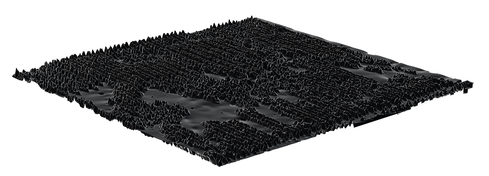

# Optical Profilometry Data Analysis

This directory contains tools for analyzing and visualizing optical profilometry XYZ data files from ceramic surface measurements.

## Example: 




## Files

- **`analyze_profilometry.py`** - Main analysis script
- **`ceramics/`** - Directory containing XYZ data files (1024×1024 height measurements)

## Requirements

```bash
pip install numpy matplotlib scipy
```

## New Features ✨

### 1. **NaN Interpolation Methods**
- **Bilinear**: Fast linear interpolation (good for most cases)
- **Laplacian**: Iterative method solving Laplace equation (excellent for edges/corners)
- **Kriging**: RBF-based smooth interpolation (slower but very smooth)

### 2. **Surface Decomposition**
Automatically separates the surface into:
- **Form**: Large-scale shape (polynomial fit)
- **Waviness**: Medium-scale features (Gaussian filtered, ~0.8mm cutoff)
- **Roughness**: Fine-scale texture (residual after form & waviness removal)

### 3. **Micron-Based Units**
All axes and measurements now use microns (µm) instead of pixels

## Usage

### Basic Analysis

```bash
# Quick analysis with 4x downsampling (recommended)
py analyze_profilometry.py ceramics/PCD_01mm_2.75x_05x_001.xyz -r 4

# Full resolution analysis
py analyze_profilometry.py ceramics/PCD_01mm_2.75x_05x_001.xyz
```

### With Interpolation (NEW!)

```bash
# Bilinear interpolation (fast, good for most cases)
py analyze_profilometry.py ceramics/PCD_01mm_2.75x_05x_001.xyz -r 4 -i bilinear

# Laplacian interpolation (best for edge/corner handling)
py analyze_profilometry.py ceramics/PCD_01mm_2.75x_05x_001.xyz -r 4 -i laplacian

# Kriging interpolation (slowest, smoothest results)
py analyze_profilometry.py ceramics/PCD_01mm_2.75x_05x_001.xyz -r 4 -i kriging
```

### Fast Processing

For faster processing, use the `-r` flag to downsample the data:

```bash
# 4x downsampling (256×256) - recommended for quick analysis
py analyze_profilometry.py ceramics/PCD_01mm_2.75x_05x_001.xyz -r 4

# 8x downsampling (128×128) - very fast
py analyze_profilometry.py ceramics/PCD_01mm_2.75x_05x_001.xyz -r 8

# 16x downsampling (64×64) - extremely fast
py analyze_profilometry.py ceramics/PCD_01mm_2.75x_05x_001.xyz -r 16
```

### Save Results to Directory

```bash
# Save visualizations and statistics to 'results' folder
py analyze_profilometry.py ceramics/PCD_01mm_2.75x_05x_001.xyz -r 4 -i bilinear -o results/
```

### Statistics Only (No Visualization)

```bash
# Just compute and print statistics
py analyze_profilometry.py ceramics/PCD_01mm_2.75x_05x_001.xyz -r 4 --stats-only
```

### Batch Processing Example

Process all files in the ceramics directory:

```bash
# Windows PowerShell
Get-ChildItem ceramics\*.xyz | ForEach-Object { py analyze_profilometry.py $_.FullName -r 4 -i bilinear -o results/ --no-display }
```

## Output

### Statistics

The script computes:

- **Data Coverage**: Total points, valid points, missing points, coverage percentage
- **Height Statistics**: Min, max, range, mean, median, standard deviation, percentiles
- **Surface Roughness Parameters**:
  - **Ra**: Average roughness (mean absolute deviation)
  - **Rq**: RMS roughness (root mean square deviation)
  - **Rz**: Maximum height (peak-to-valley)


### Visualizations (9-Panel Figure)

**Row 1 - Original Data:**
1. **2D Height Map** - Color-coded surface topography (µm)
2. **Height Distribution** - Histogram with mean and median markers (µm)
3. **Data Coverage Map** - Shows valid vs. missing data points

**Row 2 - Roughness Detail:**
4. **3D Roughness Visualization** - Interactive 3D surface plot of **roughness component** (µm)
5. **Roughness Cross-Section Profiles** - Horizontal and vertical line profiles of **roughness** (µm)
6. **Surface Gradient Map** - Shows slope/gradient magnitude

**Row 3 - Surface Decomposition:**
7. **Form** - Large-scale shape (polynomial fit)
8. **Waviness** - Medium-scale features (~0.8mm wavelength cutoff)
9. **Roughness** - Fine-scale texture

### Export to Blender

```bash
# Export roughness map as OBJ file for 3D visualization in Blender
py analyze_profilometry.py ceramics/PCD_01mm_2.75x_05x_001.xyz -r 4 -i bilinear --export-obj -o results/

# The OBJ file can be imported directly into Blender:
# File > Import > Wavefront (.obj) > Select *_roughness.obj
```

The exported OBJ file contains the roughness surface as a triangular mesh with units in millimeters.

## Command-Line Options

```
usage: analyze_profilometry.py [-h] [-r {1,2,4,8,16,32}] 
                               [-i {bilinear,laplacian,kriging}]
                               [--export-obj] [-o OUTPUT_DIR]
                               [--no-display] [--stats-only]
                               input_file

positional arguments:
  input_file            Path to XYZ profilometry data file

optional arguments:
  -h, --help            Show help message
  -r, --resolution-factor {1,2,4,8,16,32}
                        Resolution reduction factor for faster processing (default: 1)
  -i, --interpolate {bilinear,laplacian,kriging}
                        Interpolate NaN values using specified method (default: None)
  --export-obj          Export roughness map to OBJ file for Blender import
  -o, --output-dir OUTPUT_DIR
                        Directory to save output figures and statistics
  --no-display          Do not display plots interactively (only save)
  --stats-only          Only compute and print statistics, skip visualization
```

## Data Format

The XYZ files have the following structure:
- **Header**: 14 lines of metadata (includes pixel spacing information)
- **Data**: Lines with format `X Y Z` or `X Y No Data`
  - X, Y: Integer coordinates (0-1023)
  - Z: Height value (float, in µm) or "No Data" for missing measurements

## Interpolation Methods

### Bilinear
- Fast linear interpolation using scipy's griddata
- Falls back to nearest neighbor for edge/corner points
- **Best for**: General use, quick analysis

### Laplacian
- Iteratively solves Laplace equation
- Natural handling of boundaries and edges
- Converges to smooth solution
- **Best for**: Data with many edge/corner NaN values

### Kriging (RBF-based)
- Uses thin-plate spline radial basis functions
- Produces very smooth interpolations
- Computationally expensive (limited to 5000 points for speed)
- **Best for**: High-quality visualization with smooth surfaces

## Performance Tips

- Use `-r 4` or `-r 8` for initial exploration (much faster)
- Use `-r 1` (full resolution) only when you need detailed analysis
- Use `--stats-only` if you only need numerical statistics
- Use `-o` with `--no-display` for batch processing without GUI
- Bilinear interpolation is fastest; kriging is slowest but smoothest
- Pixel spacing is automatically extracted from file header

## Examples

```bash
# Quick exploration with interpolation
py analyze_profilometry.py ceramics/PCD_01mm_2.75x_05x_001.xyz -r 4 -i bilinear

# High-quality analysis with all features
py analyze_profilometry.py ceramics/PCD_01mm_2.75x_05x_001.xyz -r 2 -i laplacian -o results/

# Export roughness for Blender visualization
py analyze_profilometry.py ceramics/PCD_01mm_2.75x_05x_001.xyz -r 4 -i bilinear --export-obj -o results/

# Compare multiple samples (statistics only)
py analyze_profilometry.py ceramics/PCD_01mm_2.75x_05x_001.xyz -r 4 --stats-only
py analyze_profilometry.py ceramics/PCD_01mm_2.75x_05x_002.xyz -r 4 --stats-only
py analyze_profilometry.py ceramics/PCD_01mm_2.75x_05x_003.xyz -r 4 --stats-only
```

## Notes

- Missing data points ("No Data" in files) are handled as NaN values
- Interpolation fills NaN values before surface decomposition and visualization
- Downsampling uses mean pooling (averaging valid points in each block)
- **3D visualization and cross-sections display roughness component** for detailed texture analysis
- All statistics are computed only on valid (non-NaN) data points
- Pixel spacing and vertical scale factor extracted from header line 8
- Surface decomposition uses:
  - 2nd order polynomial for form removal
  - Gaussian filter with 0.8mm cutoff for waviness
  - Residual for roughness calculation

## Limitations and Considerations

### ⚠️ Noise Floor
The instrument has a fundamental noise floor (typically ~5-6 µm, see "Noise Floor Estimate" in statistics output). This sets the limit on measurable surface features:

- **Features smaller than the noise floor may not be reliable**
- Can artificially inflate high-frequency content in roughness measurements
- Ra/Rq values should be compared to noise floor for context

**Recommendations:**
- Check the noise floor value in the HEADER METADATA section of the statistics file
- Features with amplitudes < 2× noise floor should be interpreted cautiously
- Consider filtering or smoothing if high-frequency noise dominates the roughness

### ⚠️ Nyquist Sampling and Aliasing
With pixel spacing of **0.5 µm**, the **Nyquist limit is ~1 µm wavelength** (f_max = 1/(2Δx)):

- Spatial features with wavelengths **< ~1 µm cannot be properly resolved**
- High-frequency features may appear as lower-frequency artifacts (aliasing)
- The roughness component may include aliased content near the Nyquist limit

**Recommendations:**
- Treat features with wavelengths < 2 µm (< 4× pixel spacing) with caution
- The 0.8mm waviness cutoff is well above Nyquist, so waviness is reliable
- For analysis of fine features, ensure they are well-sampled (wavelength > 4-5 pixels)

### ⚠️ Instrument Transfer Function (MTF)
The optical profilometer's response varies with spatial frequency:

- **Lateral resolution** limited by objective NA and wavelength (~1-2 µm typical)
- **Coherence mode** (flag in header) affects edge sharpness
- **MTF attenuation** reduces measured amplitudes at high spatial frequencies
- Sharp edges and fine features appear smoothed

**Recommendations:**
- Spatial frequencies approaching the diffraction limit are attenuated
- Actual surface roughness may be **higher** than measured for high-f content
- Use the coherence flag (in header metadata) to understand measurement mode
- For critical measurements, validate against known standards

### Spatial Frequency Reliability Guide

| Wavelength Range | Reliability | Components | Notes |
|------------------|-------------|------------|-------|
| > 100 µm | ✅ Excellent | Form, Waviness | Well above all limits |
| 10-100 µm | ✅ Good | Waviness, Coarse Roughness | Reliable measurements |
| 2-10 µm | ⚠️ Caution | Medium Roughness | Check noise floor, MTF affects amplitude |
| < 2 µm | ❌ Unreliable | Fine Roughness | Near Nyquist, MTF attenuation, aliasing |

**Always report measurement conditions** (pixel spacing, noise floor, coherence mode) when sharing results!

## To-do
- subtract DC before form?  Should I consider the first big jump in the heights histogram to be the DC offset?
- additional figures
  - 3D zoomed in on a single line trough pair
  - roughness cross-section taken along the center of a scan line and the center of a trough
    - perhaps also averaging a few orthogonal peak-to-valley lines
  - export roughness to something blender compatible (obj? glb?)
- find literature and think on how substantial these surface gradients are (probably most reflective of the "sharp cutoff" of interest)
- find more reliable source for the metadata interpretation and let Jackie and Ben know if their z-scaling has been way off
- accounting for and reporting high frequency regime pitfalls
  - the noise floor
  - sampling/Nyquist — aliasing near $f_{max} = 1/(2\Delta$)
  - instrument's transfer function (objective NA, coherence mode, lateral resolution chaning at high $f$)

### spatial wavelength regimes considerations
- just consider thresholds for waviness
- consider migrating paradigms
- power spectral density (PSD)
    - detrend/level (remove piston and tilt)
    - window (Hann/Tukey) before FFT to reduce edge leakage
    - compute 2D PSD then radially average to get 1D PSD vs f
    - report band-limited RMS
- band-limited metrics with band-pass filtering
    - FFT + mask or spatial domain equivalents (Gaussian / spline / ISO filters)
- Autocorrelation / structure function (correlation lengths and isotropy)
- Wavelets / multiresolution decomposition
- Directional / oriented analysis