# Optical Profilometry Analysis Pipeline

This project contains a python pipeline for generating comprehensive analysis from optical profilometry .xyz data.  

The pipeline interpolates missing data, decomposes the surface into frequency regimes, and generates various statistics and visualizations on the surface topography, from height maps and histograms to autocorrelation and gradient distribution.

It is meant to be run from the command line with various flags to control the analysis, and can be used to generate a single analysis or batch process multiple files.

Continue reading for details or skip to the [PCD data analysis section](#PCD_images_(week_of_2026-02-09)) 

---

## Example exports: 

### 3D rendering


---

### Image analysis gamut

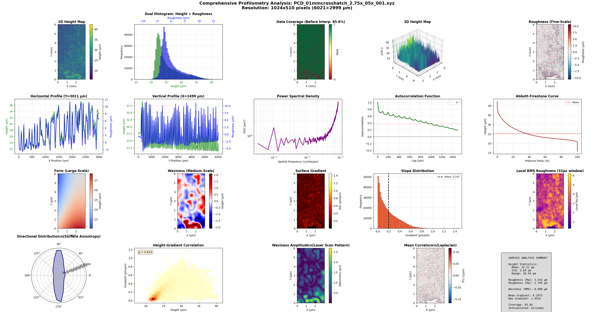

---

## **The Pipeline**

### 1. **NaN Interpolation**

Optical profilometery can be error-prone when sample features (steepness, roughness, transparency, emissivity) prevent sufficient light from reaching the detector.  Forsooth, some of the raw images here are missing nearly half of their pixels (recorded NaN/no value).  A haphazard accounting for this data can substantially alter analysis, and so we use a robust interpolation method to account for missing data.

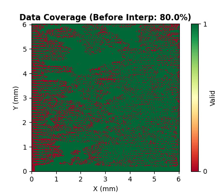

**Bilinear** 2D linear interpolation is the default method.  For extrapolation (at the edges of the dataset), it uses nearest neighbor interpolation.

*note that the [scipy.griddata](https://docs.scipy.org/doc/scipy/reference/generated/scipy.interpolate.griddata.html) function is not bilinear, per se. Instead it tessellates the space and performs linear interpolation within each triangle*

```py
# Get coordinates of valid points
valid_mask = ~nan_mask
y_valid, x_valid = np.where(valid_mask)
z_valid = data[valid_mask]

# Get coordinates of NaN points
y_nan, x_nan = np.where(nan_mask)

if len(y_nan) > 0 and len(y_valid) > 0:
    # Interpolate
    points = np.column_stack([y_valid, x_valid])
    values = z_valid
    xi = np.column_stack([y_nan, x_nan])
    
    # Use linear interpolation with nearest for extrapolation (edges/corners)
    z_interp = griddata(points, values, xi, method='linear', fill_value=np.nan)
    
    # Fill remaining NaNs (at edges) with nearest neighbor
    still_nan = np.isnan(z_interp)
    if np.any(still_nan):
        z_nearest = griddata(points, values, xi[still_nan], method='nearest')
        z_interp[still_nan] = z_nearest
    
    result[nan_mask] = z_interp
```

Laplacian and Kriging methods are available via the `-i` flag, though bilinear is the default and seems generally preferable for both speed and robustness (see the included [Interpolation Method Comparison](#gaussian-random) images for thorough testing)


### 2. **Surface Decomposition**

The surface is decomposed into three spatial frequency regimes:

- **Form**: Large-scale shape (polynomial fit)
- **Waviness**: Medium-scale features (Gaussian/Weierstrass filter)
- **Roughness**: Fine-scale texture (residual)

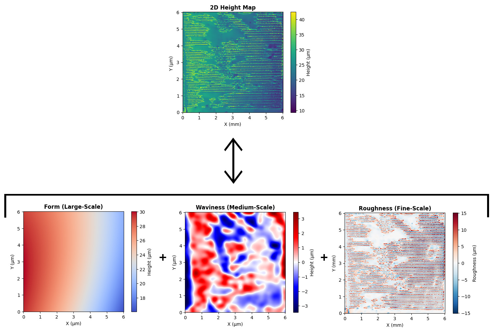

The decomposition is performed by the `decompose_surface()` function in three sequential steps:

##### Polynomial Form Extraction

```python
# 1. Form: Fit a 2nd order polynomial surface (large-scale shape)
y_coords, x_coords = np.mgrid[0:data.shape[0], 0:data.shape[1]]

# Flatten and get valid points
x_flat = x_coords[valid_mask]
y_flat = y_coords[valid_mask]
z_flat = data[valid_mask]

# Fit polynomial: z = a + bx + cy + dxx + eyy + fxy
if len(z_flat) > 6:
    A = np.column_stack([
        np.ones_like(x_flat),
        x_flat, y_flat,
        x_flat**2, y_flat**2,
        x_flat * y_flat
    ])
    
    coeffs, _, _, _ = np.linalg.lstsq(A, z_flat, rcond=None)
    
    # Evaluate polynomial on full grid
    A_full = np.column_stack([
        np.ones(x_coords.size),
        x_coords.ravel(), y_coords.ravel(),
        x_coords.ravel()**2, y_coords.ravel()**2,
        x_coords.ravel() * y_coords.ravel()
    ])
    
    form = (A_full @ coeffs).reshape(data.shape)
```

A 2nd-order polynomial fit was chosen arbitrarily, though substantial 2nd-order form seems common in the samples analyzed so far


A 1st-order fit (for removing pure 'tilt' and 'piston' planar orientations) would be simpler, but would neglect broad curvature of the sample surface

3rd-order (or higher) functions and splines can model complex curvatures and distortions (thermal warping?), but I don't fully understand their utility here and did not want to risk over-fitting

##### Gaussian Filter Waviness Extraction

```python
# 2. Remove form to get residual
residual = data - form

# 3. Waviness: Gaussian filter of residual
# Cutoff wavelength for waviness: typically 0.8mm for surface analysis
# Convert to pixels
cutoff_wavelength_um = 800  # 0.8mm
sigma_pixels = cutoff_wavelength_um / pixel_spacing_um / (2 * np.pi)

# Apply Gaussian filter (handles NaN by replacing with mean temporarily)
residual_filled = residual.copy()
residual_filled[np.isnan(residual_filled)] = np.nanmean(residual_filled)
waviness = gaussian_filter(residual_filled, sigma=sigma_pixels)
```

A 0.8mm Gaussian filter cut was chosen here.  Published metrology standards for filter cutoff values often cited include ISOs 4287, 4288, and 16610 (see [ISO 16610 Wikipedia](https://en.wikipedia.org/wiki/ISO_16610)).  0.8mm appears to be a reasonable initial guess, though I have not yet followed through with checking the roughness at other filter cutoffs (e.g., see post on [Filter Selection](https://www.mahr.com/en-us/news-events/article-view/surface-measurement-selecting-the-correct-filter)).  Smaller cutoffs will move more features into the 'roughness' category and higher cutoffs will move more features into the 'waviness' category.

Other filters are possible (e.g., band-pass, median), but Gaussian appears to be the standard.  A "robust" Gaussian may be worth exploring (see post on [Robust Gaussian Filtering](https://www.taylor-hobson.com/-/media/ametektaylorhobson/resourcelibraryassets/tech-notes/pdf/t170---robust-gaussian-filtering_en.pdf?la=en&revision=366bfa9d-acfe-46cf-a140-3a9b7635a6c9?download=1))

For markings on the scale of 10s of microns with ~100µm line spacing which appear on samples after laser processing, the 0.8mm (800 um) cutoff above the feature size, so some periodic patterns may appear in the waviness regime. As such, it may be worth playing with lower cutoffs to see if waviness with minimized periodicity grants any better insights into sample uniformity.

##### Residual Roughness Extraction

```python
# 4. Roughness: Residual after removing waviness
roughness = residual - waviness
```

Removing the low-frequency regimes effectively high-pass filters the surface, leaving the fine-scale features.  This appears to be the standard method, but other techniques to explore for isolating these features could include:
 - detrended fluctuation analysis (DFA) for fractals/self-affine surfaces for scale-dependent analysis
 - wavelet decomposition for more flexible scale separation or multiple independent length scales of roughness
 - normalized roughness (relative to waviness amplitude) where it scales with local geometry (e.g., rougher in the valleys vs the peaks)

### 3. **Downsampling**
All stages of the pipeline can be dramatically accelerated with smaller data to sample from, with full sampling taking sometimes more than 10 min between raw file processing and rendering. The downsampling CLI flag `-r` can be used to reduce effective resolution for faster processing at scales of powers of 2 (2x, 4x, 8x, 16x, 32x).  Also optionally skip the visualizer rendering with the `-v` flag.

Do note that this implementation 'mean pools' (averages) rather than 'decimates' (excludes) data, which has meaningful consequences for calculations of coverage and roughness, particularly in regions with higher NaN content.  As such, try to use the full resolution when drawing conclusions from the data which rely on the authenticity of high frequency features or when the reported NaN content is particularly high.

### 4. **Statistical Analysis**

A breakdown of the file's metadata, as well as height statistics and roughness parameters are provided by the `statistics.txt` output file.  To skip to this export in the pipeline, use the `--stats-only` flag

Example output:
```
Optical Profilometry Analysis
File: ceramics\PCD_01mm_2.75x_05x_001.xyz
Resolution Factor: 1x
Interpolation Method: bilinear
Processed Size: (1024, 1024)

============================================================
HEADER METADATA
============================================================

Lateral Sampling: 0.500 �m/pixel
Vertical Scale: 0.578416 �m/unit
Wavelength Parameter: 0.08
Coherence Flag: 1
Noise Floor Estimate: 5.880290e-06
Acquisition Time: 2026-02-09 11:45:22

============================================================
STATISTICAL ANALYSIS
============================================================

Data Coverage:
  Total points:   1,048,576
  Valid points:   1,048,576
  Missing points: 0
  Coverage:       100.00%

Height Statistics (�m):
  Min:            5.424146
  Max:            24.530035
  Range:          19.105889
  Mean:           14.357093
  Median:         14.493928
  Std Dev:        3.604031

Surface Roughness Parameters (�m):
  Ra (avg roughness):     2.880977
  Rq (RMS roughness):     3.604031
  Rz (max height):        19.105889
```

### 4. **Visual Analysis**

The visualizer window displays various sublots (currently ~20) which are designed to provide a comprehensive analysis of the surface.  

#### 4.1. Histogram

Compares original height distribution with roughness component to understand how surface texture relates to overall topology.  For lased samples with likely bimodal height distribution (peaks vs valleys), overlaid histograms can help evaluate to what extent roughness is uniform or correlates to other features.

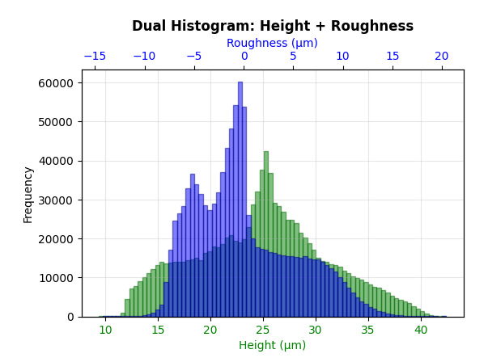

#### 4.2. Power Spectral Density (PSD)

Radially averaged 1D PSD on log-log plot for the identification of dominant spatial frequencies in the surface, revealing periodic structures.

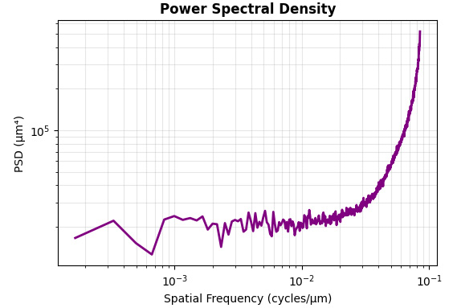

possibly useful, e.g.:
- for scan line spacing of 100µm, notice PSD peaking at 1/100µm = 0.01 cycles/µm
- when processing creates self-affine fractal roughness, PSD shows power-law decay (straight line on log-log)
- where there is deviation from power-law at specific frequencies, revealing characteristic length scales

```python
# Compute 2D FFT and radially average
fft2 = np.fft.fft2(data_filled)
psd2 = np.abs(fft2)**2

# Radial averaging
r = np.sqrt((x_idx - cx)**2 + (y_idx - cy)**2).astype(int)
for i in range(r_max):
    mask = (r == i)
    psd_radial[i] = np.mean(psd2[mask])

# Convert to spatial frequency
freq_um = np.fft.fftfreq(2*r_max, pixel_spacing_um)[:r_max]
ax.loglog(freq_um[1:], psd_radial[1:])
```

Alternative (unimplemented) similar methods to consider in the future include:

- **2D PSD heatmap:** Shows directional frequency content (use if laser scan direction is unknown)
- **Directional PSD slices:** Extract PSD along specific angles (use if scan pattern is known)
- **Welch's method:** Averages multiple overlapping windows for noise reduction

#### 4.3. Autocorrelation Function

Auto-correlation functions (ACF) measure correlation between a set of data and a shifted ("lagged") copy of itself at various distances, often used to evaluate periodicity. 

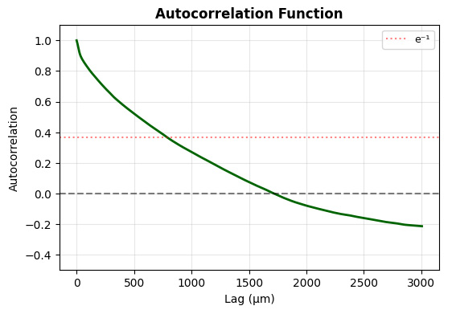

- Where autocorr = e⁻¹ is sometimes referred to as the "correlation length" (aka the "texture scale")
- Multiple oscillations suggest periodic structure; fast decay suggests random roughness
- For lased samples, high periodicity is expected at scan-line spacing and its multiples

The ACF implemented here was normalized at zero lag and plotted as a 1D slice:

```python
fft_ac = np.fft.fft2(data_centered)
autocorr = np.fft.ifft2(np.abs(fft_ac)**2).real
autocorr = np.fft.fftshift(autocorr)
autocorr /= autocorr[cy, cx]  # Normalize

# Plot central slice
autocorr_slice = autocorr[cy, cx:]
lag_um = np.arange(len(autocorr_slice)) * pixel_spacing_um
```

Alternative (unimplemented) similar methods to consider in the future include:

- **2D autocorrelation heatmap:** Reveals anisotropic correlation (elliptical vs circular)
- **Fit exponential decay:** Extract correlation length quantitatively
- **Structure function:** Sometimes preferred for fractal surfaces

*Note that the original implementation used a convolution method (scipy.signal.correlate2D) which operates at $O(N^4)$ (1000x1000 pixel image -> 10^12 operations).  The FFT switch is $O(N^2 log N)$, which shaved about 10 minutes off my run time and produced results which did not seem substantially different to my eye.  I'll leave the convolution method commented in the script*

#### 4.4. Bearing Ratio (Abbott-Firestone Curve)

The Abbot-Firestone curve is another way of illustrating the height distribution. It shows what fraction of surface area lies above any given height threshold. Supposedly, it is sometimes preferred over (alongside?) the histogram in engineering contexts where its features help highlight texture, wear, and lubrication retention.

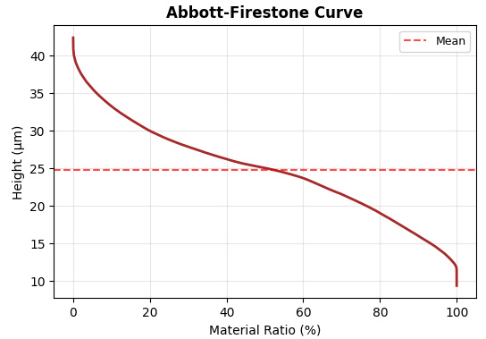

Shallow slopes indicate a uniform surface (e.g., smooth/polished wafers).  Steep slopes in the middle indicate bimodal distributions (e.g., peaks and valleys from laser lines).  In lased samples, we can look for stepped transitions at peak/valley heights.

```python
sorted_heights = np.sort(valid_data)[::-1]  # Descending order
bearing_ratio = np.arange(len(sorted_heights)) / len(sorted_heights) * 100

ax.plot(bearing_ratio, sorted_heights)
ax.axhline(np.nanmean(data), color='red', label='Mean')
```

#### 4.5. Directional Analysis (Anisotropy)

A polar histogram of surface gradient directions reveals preferential orientations in existing textural patterns.

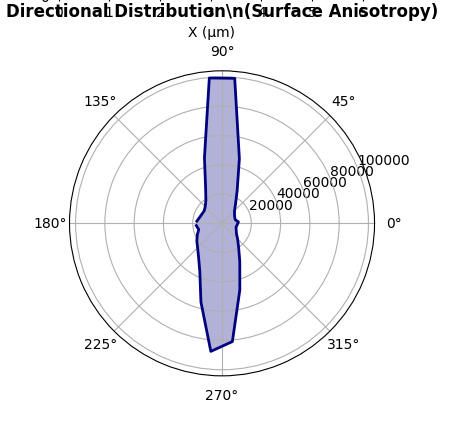

- Circular distribution suggests isotropic (random) surface
- Bimodal peaks ±90° apart indicate perpendicular scan lines (like the crosshatch), and the comparative strength may help evaluate any dependence on the order of the scans

This implementation uses 36 bins (10° resolution) on polar plot (coarser binning may reduce noise, but also detail):

```python
# Compute gradient direction
gy, gx = np.gradient(data)
grad_angle = np.arctan2(gy, gx)

# Polar histogram
n_bins = 36
bins = np.linspace(-np.pi, np.pi, n_bins+1)
hist, _ = np.histogram(valid_angles, bins=bins)

theta = (bins[:-1] + bins[1:]) / 2
ax_polar.plot(theta, hist)
ax_polar.fill(theta, hist, alpha=0.3)
```

Alternative (unimplemented) similar methods to consider in the future include:

- **Rose diagram:** Weighted by gradient magnitude (emphasizes steep slopes)
- **Fourier analysis of angles:** Possibly more explicit characterization of anisotropy

#### 4.6. Local Roughness Map

Local roughness maps can magnify feature scales of interest. Maybe try window sizes >> roughness wavelength but << pattern wavelength

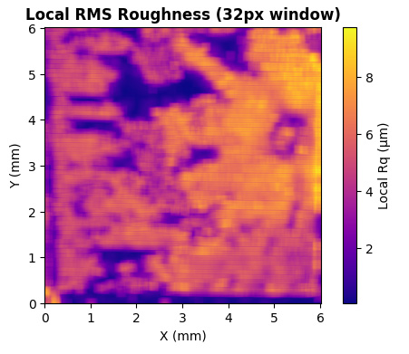

The local roughness map implemented here chose an adaptive window size of data_size/32

```python
from scipy.ndimage import uniform_filter

roughness_filled = np.where(np.isnan(roughness), 0.0, roughness)
local_roughness = np.sqrt(uniform_filter(roughness_filled**2, size=window_size))
local_roughness[np.isnan(roughness)] = np.nan
```

- **Fixed window size:** Use known feature size (e.g., 100µm for laser spacing)
- **Ra instead of RMS:** Less sensitive to outliers
- **Percentile-based:** Use 95th percentile for peak roughness mapping

*note that the original implementation used a scipy.ndimage.generic_filter which was somewhat slow, and so it was replaced with the vectorized equivalent, scipy.ndimage.uniform filter.  The original version is left commented in the code*

#### 4.7. Slope Distribution

Histogram of surface gradients indicates steepness distribution, which can be relevant to optical and fluid contact properties.

Mean gradient indicates average steepness, which relates to light scattering behavior.   Rayleigh distribution suggests random Gaussian surface.  If laser creates sharp edges, expect heavy tail (high gradients).  Steep slopes also inhibit attachment (e.g., cell adhesion studies, possibly fouling related?)

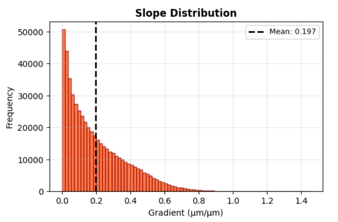

This implementation uses an L2 norm (magnitude) and is normalized by pixel spacing:

```python
gy, gx = np.gradient(np.nan_to_num(data, nan=0))
gradient_mag = np.sqrt(gx**2 + gy**2) / pixel_spacing_um  # Dimensionless

ax.hist(valid_gradients, bins=80, color='orangered')
ax.axvline(np.mean(valid_gradients), color='black', linestyle='--',
           label=f'Mean: {np.mean(valid_gradients):.3f}')
```

I could also try separating the x and y components to search for directional bias in slopes (similar to directional anisotropy graph).  A log scale may be worth checking out too.

#### 4.8. Height-Gradient Hexbin Correlation

Probably no good reason for a [hexbin](https://medium.com/@mattheweparker/visualizing-data-with-hexbins-in-python-39823f89525e) to be in here but I've gone and spaghetti'd up the figure generator so bad that it bugs out when I remove it

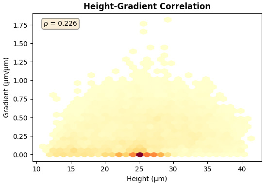

```python
valid_height = data[~np.isnan(data) & ~np.isnan(gradient_mag)]
valid_grad = gradient_mag[~np.isnan(data) & ~np.isnan(gradient_mag)]

# Sample for performance
if len(valid_height) > 10000:
    indices = np.random.choice(len(valid_height), 10000, replace=False)
    valid_height, valid_grad = valid_height[indices], valid_grad[indices]

ax.hexbin(valid_height, valid_grad, gridsize=30, cmap='YlOrRd')
corr = np.corrcoef(valid_height, valid_grad)[0, 1]
ax.text(0.05, 0.95, f'ρ = {corr:.3f}', ...)
```
#### 4.9. Curvature Map

Curvature can be used to identify regions of stress concentration (fracture initiation sites).  These maps can also behelpful in identifying features for targeted microscopy follow-up (SEM, AFM)

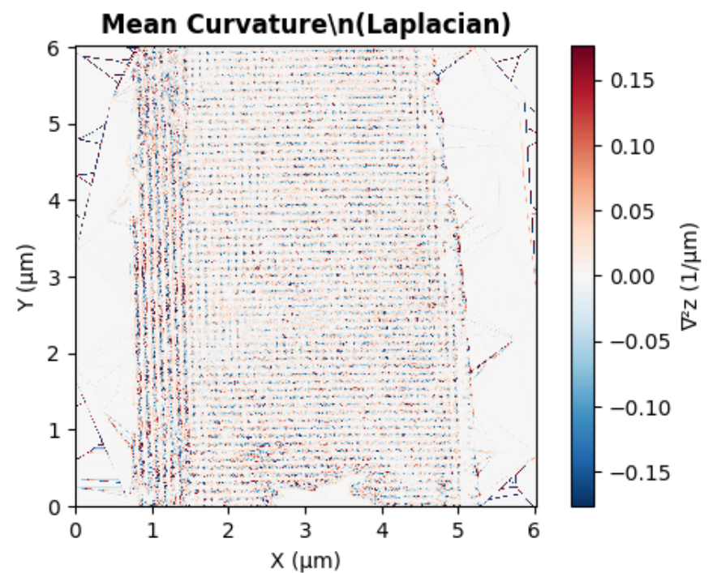

Positive curvature = peaks/bumps, negative = valleys/dips

Curvature is determined here through a Laplacian:

```python
from scipy.ndimage import laplace
curvature = laplace(data) / (pixel_spacing_um**2)
ax.imshow(curvature, cmap='RdBu_r', vmin=-3*std, vmax=3*std)
```

Possible alternatives with similar utility may include Gaussian curvature (the product of principal curvatures for the detection of saddle points) and  principal curvatures (Eigenvalues of Hessian matrix to show max/min curvature)

### 5. **Export to Blender**
Optionally export roughness map as OBJ file for import and rendering in Blender 3D

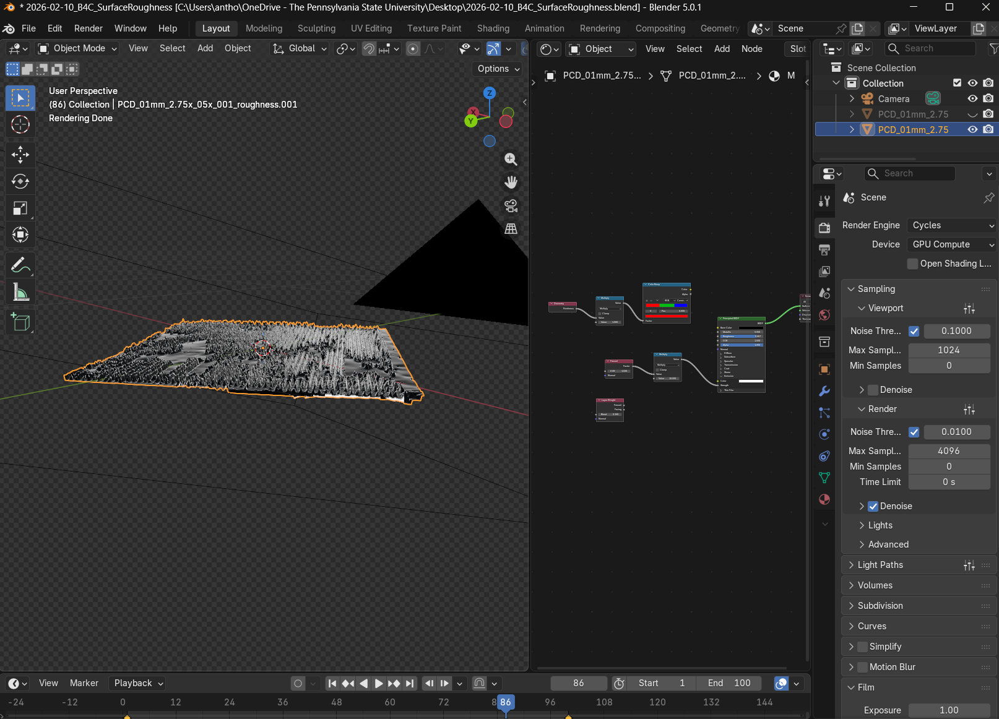

---

## Command-Line Options

```
usage: analyze_profilometry.py [-h] [-r {1,2,4,8,16,32}] 
                               [-i {bilinear,laplacian,kriging}]
                               [--export-obj] [-o OUTPUT_DIR]
                               [--no-display] [--stats-only]
                               [--bounds X1 X2 Y1 Y2]
                               input_file

positional arguments:
  input_file            Path to XYZ profilometry data file

optional arguments:
  -h, --help            Show help message
  -r, --resolution-factor {1,2,4,8,16,32}
                        Resolution reduction factor for faster processing (default: 1)
  -i, --interpolate {bilinear,laplacian,kriging}
                        Interpolate NaN values using specified method (default: None)
  --export-obj          Export roughness map to OBJ file for Blender import
  -o, --output-dir OUTPUT_DIR
                        Directory to save output figures and statistics
  --no-display          Do not display plots interactively (only save)
  --stats-only          Only compute and print statistics, skip visualization
  --bounds X1 X2 Y1 Y2  Crop image bounds in microns (x1 x2 y1 y2)
```
*(Pixel spacing is automatically extracted from .xyz header metadata after the 2026-02-17 push)*

## Example Usages

```bash
# Full resolution analysis, default to bilinear inerpolation
py analyze_profilometry.py heightmaps/PCD_01mm_2.75x_05x_001.xyz

# Save cropped, kriging-interpolated vis/stats to 'results' folder
py analyze_profilometry.py heightmaps/PCD_01mm_2.75x_05x_001.xyz -r 4 -i kriging -o --bounds 100 400 200 500 results/

# Export roughness map as OBJ file (for 3D visualization in Blender or elsewhere)
py analyze_profilometry.py heightmaps/PCD_01mm_2.75x_05x_001.xyz --export-obj -o results/

# Windows PowerShell Batch Processing
Get-ChildItem heightmaps\*.xyz | ForEach-Object { py analyze_profilometry.py $_.FullName -r 4 -i bilinear -o results/ --no-display }
```

---

# PCD images (week of 2026-02-09)

## Standard - 100 um scan interval (1)


## Standard - 100 um scan interval (2)

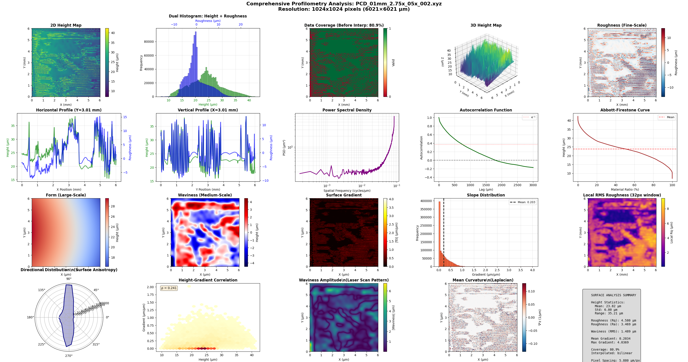

## Standard - 100 um scan interval (3)

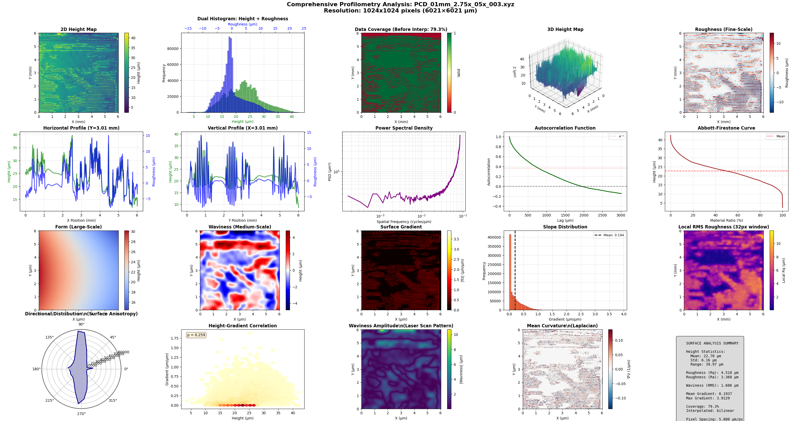

---

## PCD_01mminter_2.75x_05x (1)

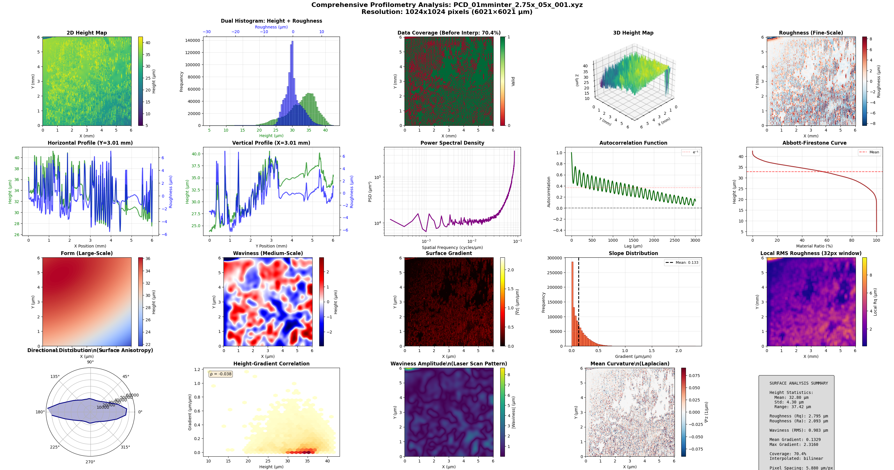

## PCD_01mminter_2.75x_05x (2)

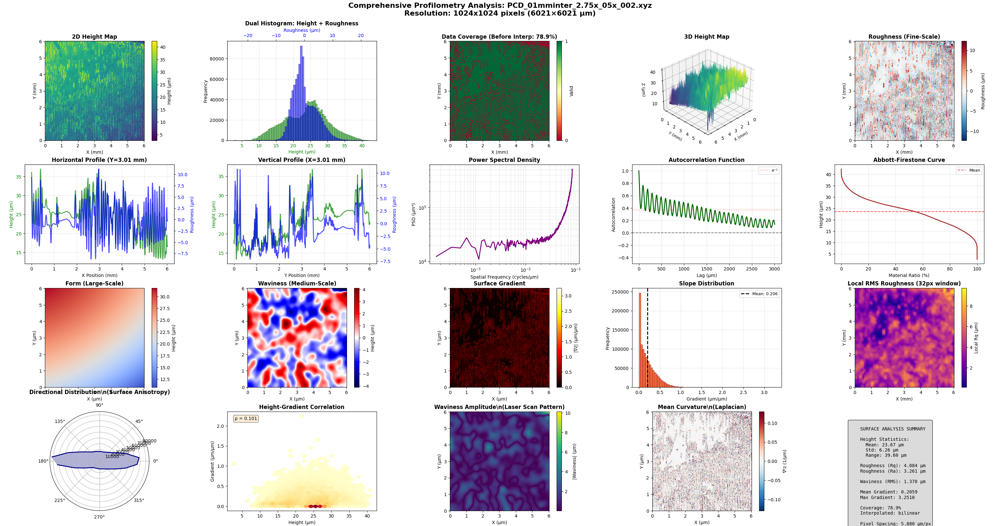

## PCD_01mminter_2.75x_05x (3)

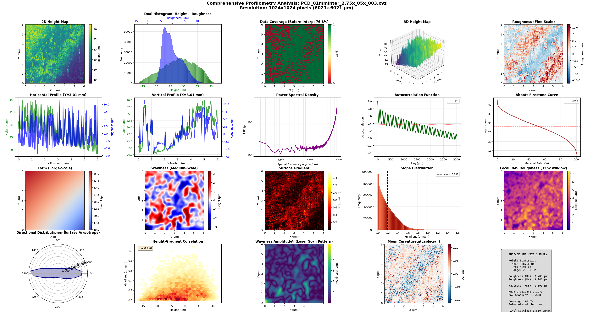

---

## Cross-hatch (1)

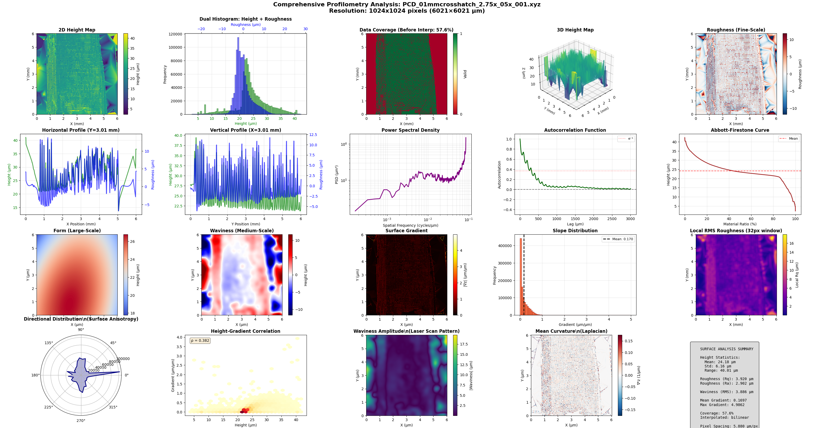

## Cross-hatch (2)

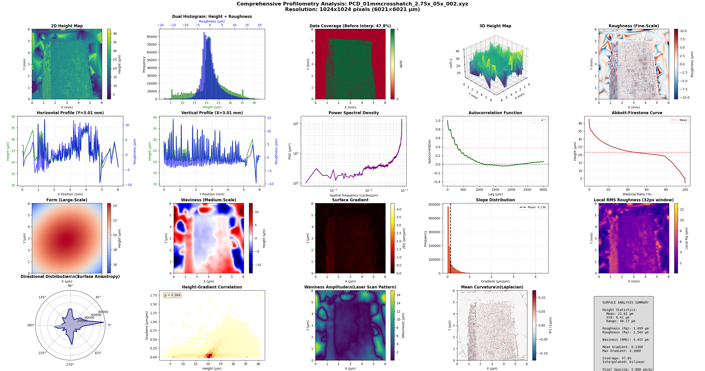

## Cross-hatch (3)

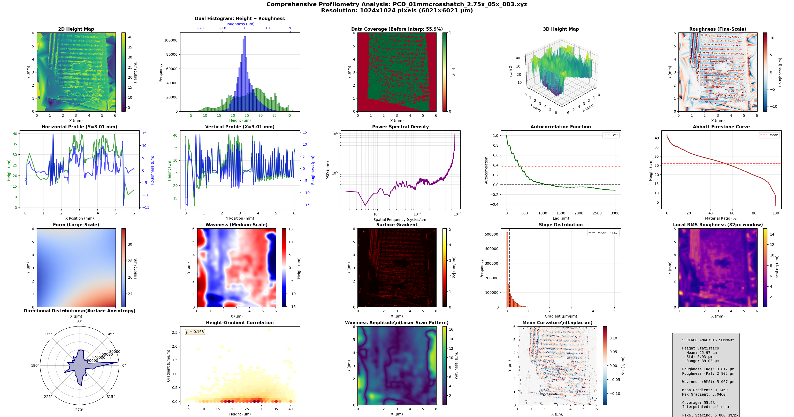

---

## 2x line density (1)

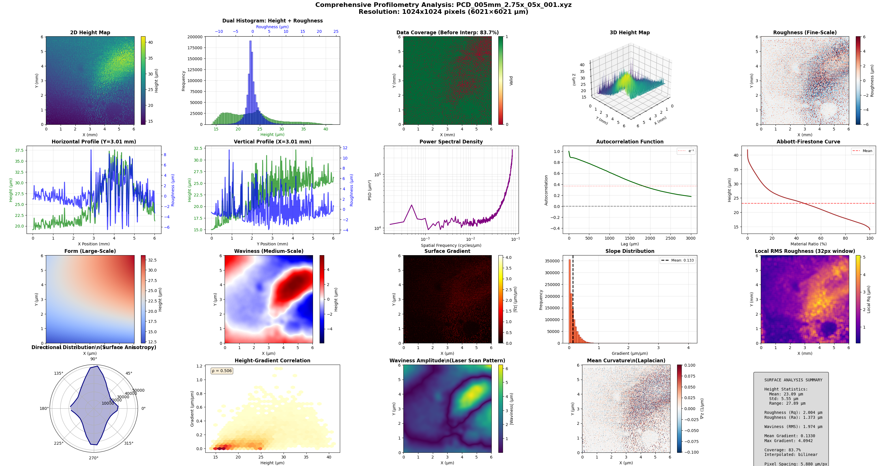

## 2x line density (2)

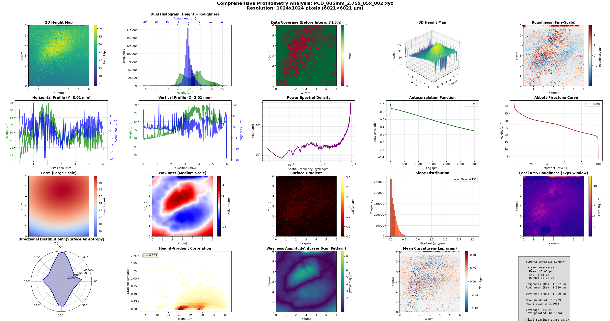

## 2x line density (3)

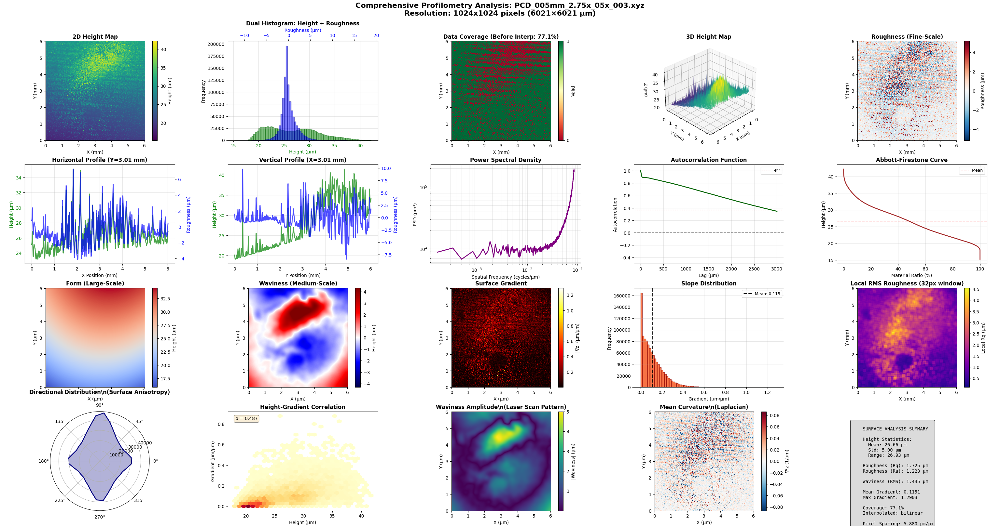

---

---

# Synthetic Interpolation Study

The script `interpolation_study.py` provides a framework for validating interpolation strategies on synthetic 128x128 surfaces. It aims to replicate the kinds of artifacts and features expected in our PCD profilometry imaging, including stepped geometries and various distributions of noise for simulated data loss.

# interpolation methods exploration

### 1. Nearest Neighbor
Assigns the value of the visually closest data point.
$$f(x, y) = f(x_i, y_i) \quad \text{where} \quad \sqrt{(x-x_i)^2 + (y-y_i)^2} \text{ is minimized}$$

### 2. Bilinear Interpolation
A linear extension of 1D interpolation, estimating the value based on the four nearest neighbors.
$$f(x, y) \approx a_0 + a_1 x + a_2 y + a_3 xy$$

### 3. Bicubic Interpolation
Uses a third-degree polynomial (cubic spline) for smoother transitions, utilizing a $4 \times 4$ neighborhood.
$$f(x, y) = \sum_{i=0}^3 \sum_{j=0}^3 a_{ij} x^i y^j$$

### 4. Laplacian Diffusion
Solves the steady-state diffusion (Laplace) equation to fill holes, ensuring a "smooth" harmonic transition.
$$\nabla^2 f = \frac{\partial^2 f}{\partial x^2} + \frac{\partial^2 f}{\partial y^2} = 0$$

### 5. Kriging / RBF (Radial Basis Function)
Computes a weighted sum of basis functions centered at valid data points. The script defaults to the **Thin Plate Spline** kernel.
$$f(\mathbf{x}) = \sum_{i=1}^n w_i \phi(\|\mathbf{x} - \mathbf{x}_i\|) + P(\mathbf{x})$$
Where the Thin Plate Spline kernel is defined as:
$$\phi(r) = r^2 \ln(r)$$

## Features
- **Noise Models**: Gaussian (Additive), Poisson (Shot), and Speckle (Multiplicative).
- **Visualization**: Generates `comparison_<noise>_<mask_type>.png` plots showing Ground Truth, Masked Input, Reconstructions, and Difference Maps ($|Original - Reconstructed|$).

---

## gaussian random


## gaussian scratch

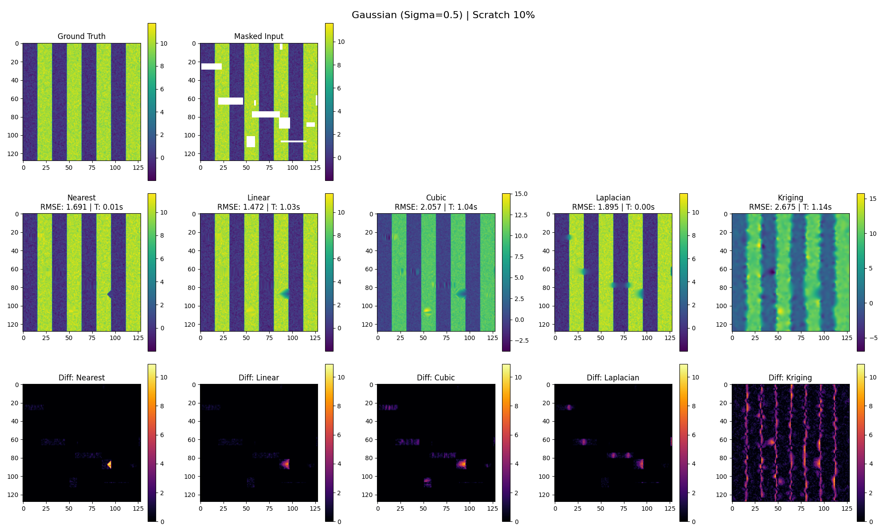

---

## poisson random

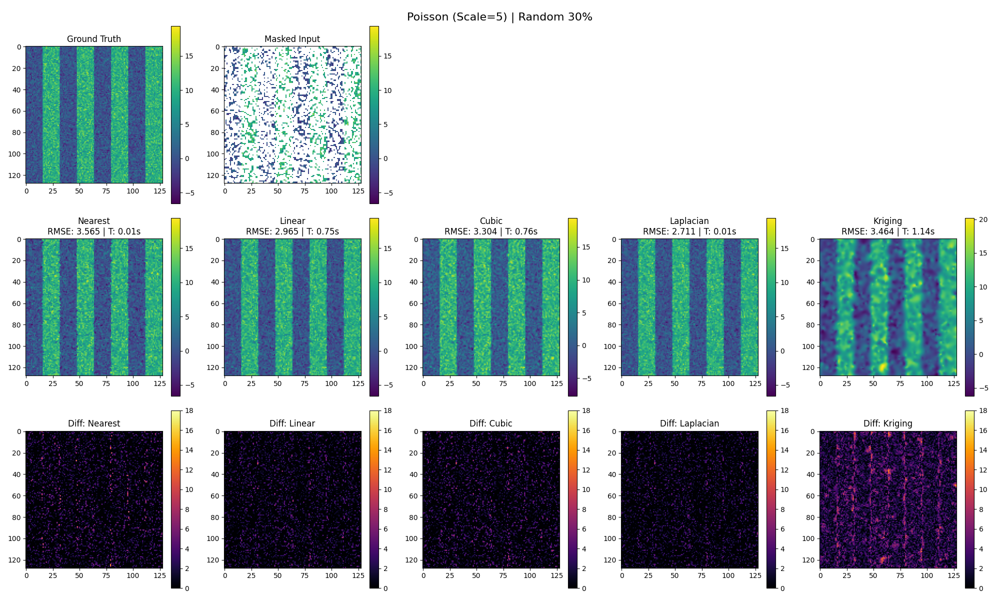

## poisson scratch

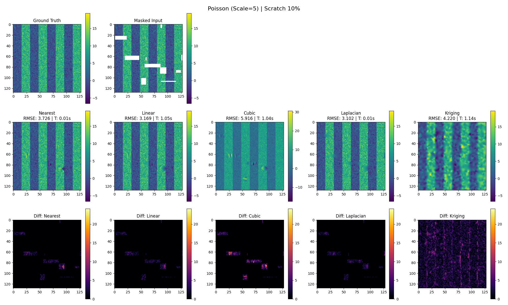

---

## speckle random

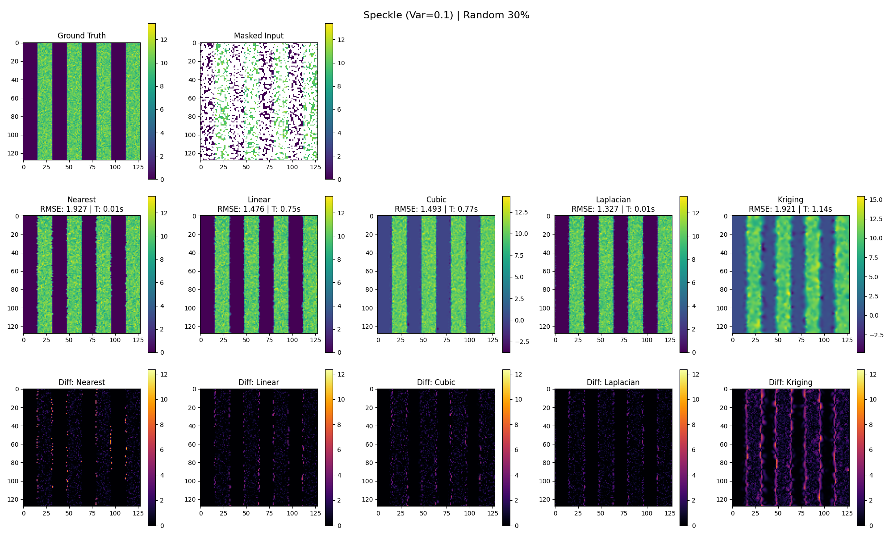

## speckle scratch


---

## To-do
 - isolate sample in figures where background is present/NaN
   - ability to draw line through the image to pull out a cross section (dealing with aliasing?)
- there must be something brokenw ith the visualizations...that's where 90% of the pipeline computation is going
- really scour ben's repo for pitfalls I've run into unwittingly
- literature 
   - get basic foundation into the literature folder
   - find/think on how substantial these surface gradients are (probably most reflective of the "sharp cutoff" of interest)
   - figure out where Ben found the Zygo manual and find what that other metadata header value means
- Is that value from the header the noise floor?
- accounting for and reporting high frequency regime pitfalls
  - the noise floor
  - sampling/Nyquist — aliasing near $f_{max} = 1/(2\Delta$)
  - instrument's transfer function (objective NA, coherence mode, lateral resolution chaning at high $f$)
- re-use the FFT rather than re-calculating it each time
- try another interpolation study with a sample with less stepped variations (smoother corners) and mask specifically at the valleys to more properly model the noise from the lased samples

## Discussion
- unless I'm missing something, it seems like the sample thickness must be both much greater than reported previously.  Precise thickness determinations are difficult because I can't find any good images where we can see the substrate, but even just the waviness variations span more than 10 um of height
   - how thin would it need to be to be visible?  
      - to interfere? could I angle it with the IR and see where interference arises?
   - are the substrates that far away (/the samples that thick?) what's the maximum vertical distance the profilometer can see?  Is it more likely the sapphire is scattering the light?  --> try again but with (1) thinnest emissive coating on hand and/or (2) spatula-smudged edge/bevel to create a clear ramp leading from ~peak to surface visible from above

---

## Some image analysis reading

### Surface Roughness Parameters (Ra, Rq, Rz)
- **ISO 4287:1997** — *Geometrical Product Specifications (GPS) – Surface texture: Profile method – Terms, definitions and surface texture parameters.* Defines arithmetic mean roughness (Ra), RMS roughness (Rq), and maximum height (Rz).
- **ISO 25178-2:2012** — *Geometrical product specifications (GPS) – Surface texture: Areal – Part 2: Terms, definitions and surface texture parameters.* Extends profile roughness parameters (Ra, Rq) to areal (Sa, Sq) for 2D surface maps.

### Surface Decomposition (Form / Waviness / Roughness)
- **ISO 16610-21:2011** — *Geometrical product specifications (GPS) – Filtration – Part 21: Linear profile filters: Gaussian filters.* Defines the Gaussian filter for separating roughness from waviness (replaces ISO 11562).
- **ISO 16610-61:2015** — *Geometrical product specifications (GPS) – Filtration – Part 61: Linear areal filters: Gaussian filters.* Areal (2D) Gaussian filter for surface texture decomposition.
- Raja, J., Muralikrishnan, B., & Fu, S. (2002). "Recent advances in separation of roughness, waviness and form." *Precision Engineering*, 26(2), 222–235. doi:10.1016/S0141-6359(02)00103-X

### Power Spectral Density (PSD)
- Jacobs, T.D.B., Junge, T., & Pastewka, L. (2017). "Quantitative characterization of surface topography using spectral analysis." *Surface Topography: Metrology and Properties*, 5(1), 013001. doi:10.1088/2051-672X/aa51f8
- Persson, B.N.J., Albohr, O., Tartaglino, U., Volokitin, A.I., & Tosatti, E. (2005). "On the nature of surface roughness with application to contact mechanics, sealing, rubber friction and adhesion." *Journal of Physics: Condensed Matter*, 17(1), R1–R62. doi:10.1088/0953-8984/17/1/R01

### Autocorrelation Function & Correlation Length
- Whitehouse, D.J. & Archard, J.F. (1970). "The properties of random surfaces of significance in their contact." *Proceedings of the Royal Society of London A*, 316(1524), 97–121. doi:10.1098/rspa.1970.0068
- Thomas, T.R. (1999). *Rough Surfaces*, 2nd ed. Imperial College Press. (Comprehensive treatment of autocorrelation, structure functions, and spectral characterization of surfaces.)

### Abbott-Firestone Curve (Bearing Ratio)
- Abbott, E.J. & Firestone, F.A. (1933). "Specifying surface quality: A method based on accurate measurement and comparison." *Mechanical Engineering*, 55, 569–572.
- **ISO 13565-2:1996** — *Geometrical Product Specifications (GPS) – Surface texture: Profile method – Surfaces having stratified functional properties – Part 2: Height characterization using the linear material ratio curve.* Standardizes the bearing ratio curve and derived parameters (Rk, Rpk, Rvk).

### Surface Gradient & Slope Distribution
- Gadelmawla, E.S., Koura, M.M., Maksoud, T.M.A., Elewa, I.M., & Soliman, H.H. (2002). "Roughness parameters." *Journal of Materials Processing Technology*, 123(1), 133–145. doi:10.1016/S0924-0136(02)00060-2
- Nayak, P.R. (1971). "Random process model of rough surfaces." *Journal of Lubrication Technology*, 93(3), 398–407. doi:10.1115/1.3451608

### Directional Analysis (Anisotropy)
- Stout, K.J. et al. (1993). *The Development of Methods for the Characterisation of Roughness in Three Dimensions.* EUR 15178 EN, Commission of the European Communities.
- **ISO 25178-2:2012**, §4.3 — Defines the texture direction parameter (Std) and texture aspect ratio (Str) for quantifying surface anisotropy.

### Curvature Map (Laplacian)
- Brown, C.A., Hansen, H.N., Jiang, X.J., Blateyron, F., Berglund, J., Senin, N., Bartkowiak, T., Dixon, B., Le Goïc, G., Quinsat, Y., & Stemp, W.J. (2018). "Multiscale analyses and characterizations of surface topographies." *CIRP Annals*, 67(2), 839–862. doi:10.1016/j.cirp.2018.06.001
- Bartkowiak, T. & Brown, C.A. (2019). "Multiscale 3D curvature analysis of processed surface textures of aluminum alloy 6061 T6." *Materials*, 12(2), 257. doi:10.3390/ma12020257

### Local Roughness Map (Sliding-Window RMS)
- Jiang, X., Scott, P.J., Whitehouse, D.J., & Blunt, L. (2007). "Paradigm shifts in surface metrology. Part II. The current shift." *Proceedings of the Royal Society A*, 463(2085), 2071–2099. doi:10.1098/rspa.2007.1873

### NaN Interpolation (Bilinear, Laplacian Diffusion, Kriging / RBF)
- Duchon, J. (1977). "Splines minimizing rotation-invariant semi-norms in Sobolev spaces." In *Constructive Theory of Functions of Several Variables*, Lecture Notes in Mathematics, Vol. 571, 85–100. Springer-Verlag. (Foundational work on thin-plate splines used in RBF interpolation.)
- Matheron, G. (1963). "Principles of geostatistics." *Economic Geology*, 58(8), 1246–1266. doi:10.2113/gsecongeo.58.8.1246 (Foundational kriging reference.)
- Francisco, A., Brunetière, N., & Merceron, G. (2020). "Damaged digital surfaces also deserve realistic healing." *Surface Topography: Metrology and Properties*, 8(3), 035008. doi:10.1088/2051-672X/aba0da (Laplacian diffusion for surface reconstruction.)

## Resources

- https://en.wikipedia.org/wiki/White_light_interferometry
- https://en.wikipedia.org/wiki/Radial_basis_function_interpolation
- https://en.wikipedia.org/wiki/Kriging

### MSC's Profilometer Description

> #### Zygo Nexview 3D Optical Surface Profiler:
> White Light Interferometry.
> 2.5x, 10x, 20x, 50x objectives with 0.5x, 1x, 2x internal magnification.
> Automated image stitching.
> 200mm XY stage and 100mm Z clearance with capacity for up to 10lbs.
> A white light interferometer is a type of profilometer in which light from a lamp is split into two paths by a beam splitter. One path directs the light onto the surface under test, the other path directs the light to a reference mirror. Reflections from the two surfaces are recombined and projected onto an array detector. When the path difference between the recombined beams is on the order of a few wavelengths of light or less, interference can occur. This interference contains information about the surface contours of the test surface. Vertical resolution can be on the order of several angstroms while lateral resolution depends upon the system and objective and is typically in the range of 0.26um – 4.4um.