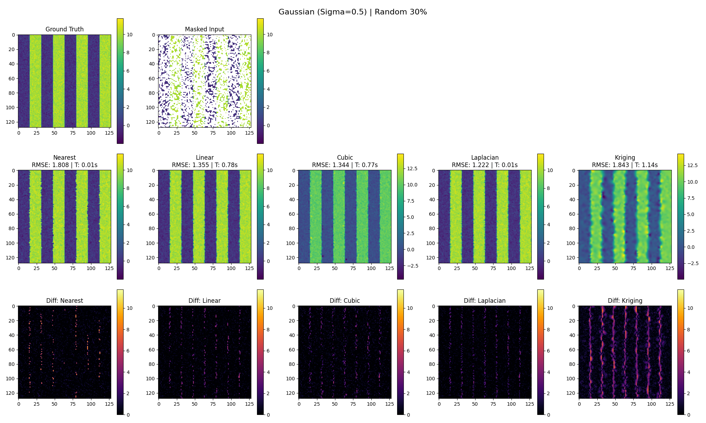
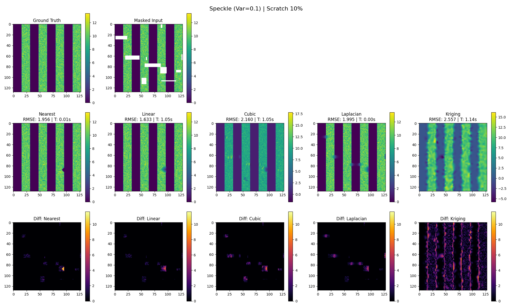
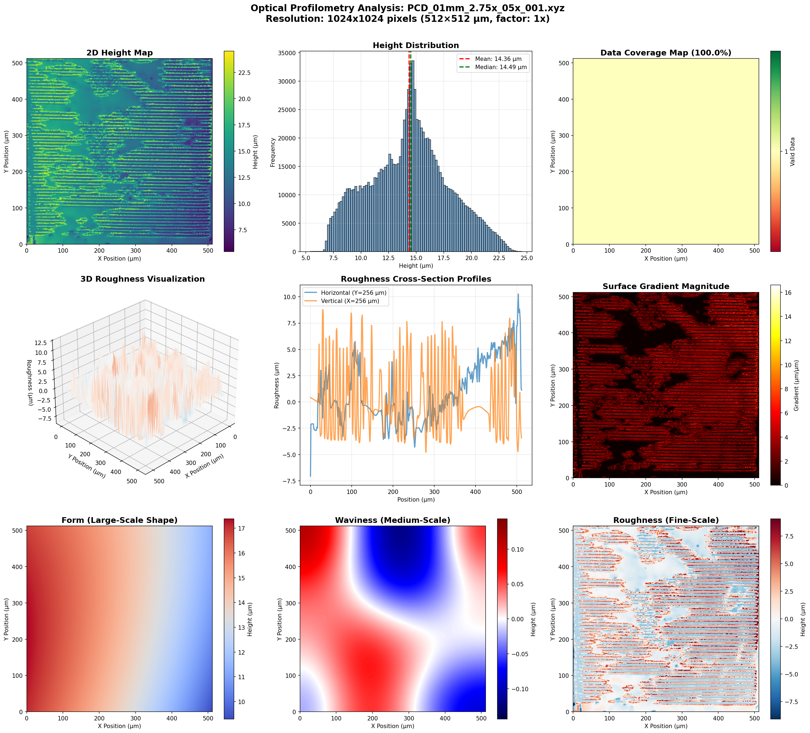
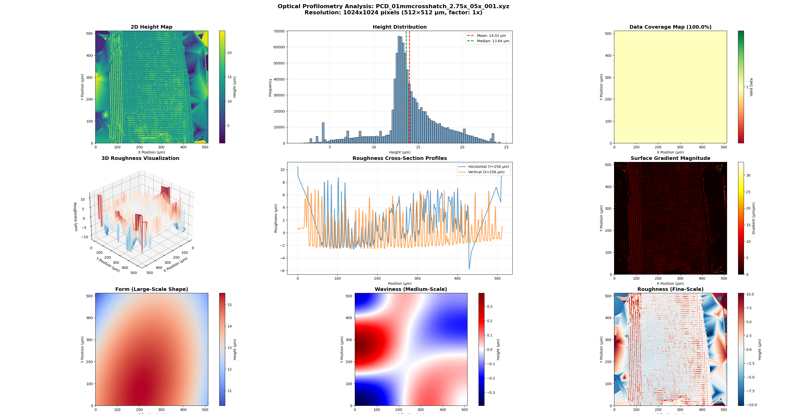
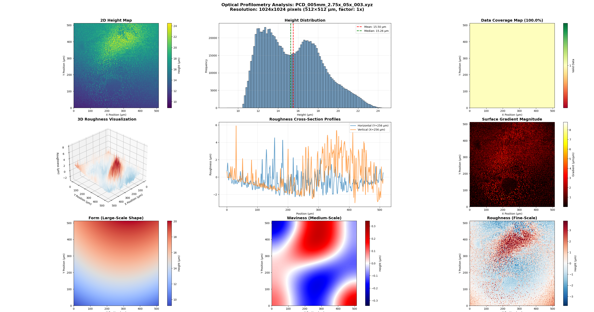

# Optical Profilometry Analysis Pipeline

This directory contains a python pipeline for analyzing and visualizing optical profilometry .xyz data.

---

## Example exports: 

### Topology processing


---

### 3D rendering


---

### interpolation method comparison

---

## How it works

### 1. **NaN Interpolation Method**
- **Bilinear**: 2D linear interpolation
  - Laplacian and Kriging methods are available via the `-i` flag, though bilinear is the default and seems generally preferable for both speed and robustness

### 2. **Surface Decomposition**

The surface is decomposed into three spatial frequency regimes:

- **Form**: Large-scale shape (polynomial fit)
- **Waviness**: Medium-scale features (Gaussian/Weierstrass filter)
- **Roughness**: Fine-scale texture (residual)

The decomposition is performed by the `decompose_surface()` function in three sequential steps:

##### Polynomial Form Extraction

```python
# 1. Form: Fit a 2nd order polynomial surface (large-scale shape)
y_coords, x_coords = np.mgrid[0:data.shape[0], 0:data.shape[1]]

# Flatten and get valid points
x_flat = x_coords[valid_mask]
y_flat = y_coords[valid_mask]
z_flat = data[valid_mask]

# Fit polynomial: z = a + bx + cy + dxx + eyy + fxy
if len(z_flat) > 6:
    A = np.column_stack([
        np.ones_like(x_flat),
        x_flat, y_flat,
        x_flat**2, y_flat**2,
        x_flat * y_flat
    ])
    
    coeffs, _, _, _ = np.linalg.lstsq(A, z_flat, rcond=None)
    
    # Evaluate polynomial on full grid
    A_full = np.column_stack([
        np.ones(x_coords.size),
        x_coords.ravel(), y_coords.ravel(),
        x_coords.ravel()**2, y_coords.ravel()**2,
        x_coords.ravel() * y_coords.ravel()
    ])
    
    form = (A_full @ coeffs).reshape(data.shape)
```

A 2nd-order polynomial fit was chosen arbitrarily, though substantial 2nd-order form seems common in the samples analyzed so far


A 1st-order fit (planar; remove 'tilt' and 'piston') would be simpler, but would neglect broad curvature of the sample surface

3rd-order (or higher) functions and splines can model complex curvatures and distortions (thermal warping?), but I don't fully understand their utility here and did not want to risk over-fitting

##### Gaussian Filter Waviness Extraction

```python
# 2. Remove form to get residual
residual = data - form

# 3. Waviness: Gaussian filter of residual
# Cutoff wavelength for waviness: typically 0.8mm for surface analysis
# Convert to pixels
cutoff_wavelength_um = 800  # 0.8mm
sigma_pixels = cutoff_wavelength_um / pixel_spacing_um / (2 * np.pi)

# Apply Gaussian filter (handles NaN by replacing with mean temporarily)
residual_filled = residual.copy()
residual_filled[np.isnan(residual_filled)] = np.nanmean(residual_filled)
waviness = gaussian_filter(residual_filled, sigma=sigma_pixels)
```

A 0.8mm Gaussian filter cut was chosen here.  Published metrology standards for filter cutoff values often cited include ISOs 4287, 4288, and 16610 (https://en.wikipedia.org/wiki/ISO_16610).  0.8mm appears to be a reasonable initial guess, though I have not yet followed through with checking the roughness at other filter cutoffs (e.g., https://www.mahr.com/en-us/news-events/article-view/surface-measurement-selecting-the-correct-filter).  Smaller cutoffs will move more features into the 'roughness' category and higher cutoffs will move more features into the 'waviness' category.

Other filters are possible (e.g., band-pass, median), but Gaussian appears to be the standard.

For markings on the scale of 10s of microns with ~100µm line spacing which appear on samples after laser processing, the 0.8mm (800 um) cutoff above the feature size, so some periodic patterns may appear in the waviness regime. As such, it may be worth playing with lower cutoffs to see if waviness with minimized periodicity grants any better insights into sample uniformity.

##### Residual Roughness Extraction

```python
# 4. Roughness: Residual after removing waviness
roughness = residual - waviness
```

Removing the low-frequency regimes effectively high-pass filters the surface, leaving the fine-scale features.  This appears to be the standard method, but other techniques to explore for isolating these features could include:
 - detrended fluctuation analysis (DFA) for fractals/self-affine surfaces for scale-dependent analysis
 - wavelet decomposition for more flexible scale separation or multiple independent length scales of roughness
 - normalized roughness (relative to waviness amplitude) where it scales with local geometry (e.g., rougher in the valleys vs the peaks)

### 3. **Downsampling**
All stages of the pipeline can be dramatically accelerated with smaller data to sample from, with full sampling taking sometimes 3-5 minutes from raw file processing to visualization. The downsampling CLI flag `-r` can be used to reduce effective resolution for faster processing at scales of powers of 2 (2x, 4x, 8x, 16x, 32x).  Also optionally skip the visualizer rendering with the `-v` flag.

Do note that this implementation 'mean pools' (averages) rather than 'decimates' (excludes) data which has meaningful consequences when calculating coverage and roughness.  As such, try to use the full resolution when drawing conclusions from the data which rely on the authenticity of high frequency features.

### 4. **Statistical Analysis**

A breakdown of the file's metadata, as well as height statistics and roughness parameters are provided by the `statistics.txt` output file.  To skip to this export in the pipeline, use the `--stats-only` flag

```
Optical Profilometry Analysis
File: ceramics\PCD_01mm_2.75x_05x_001.xyz
Resolution Factor: 1x
Interpolation Method: bilinear
Processed Size: (1024, 1024)

============================================================
HEADER METADATA
============================================================

Lateral Sampling: 0.500 �m/pixel
Vertical Scale: 0.578416 �m/unit
Wavelength Parameter: 0.08
Coherence Flag: 1
Noise Floor Estimate: 5.880290e-06
Acquisition Time: 2026-02-09 11:45:22

============================================================
STATISTICAL ANALYSIS
============================================================

Data Coverage:
  Total points:   1,048,576
  Valid points:   1,048,576
  Missing points: 0
  Coverage:       100.00%

Height Statistics (�m):
  Min:            5.424146
  Max:            24.530035
  Range:          19.105889
  Mean:           14.357093
  Median:         14.493928
  Std Dev:        3.604031

Surface Roughness Parameters (�m):
  Ra (avg roughness):     2.880977
  Rq (RMS roughness):     3.604031
  Rz (max height):        19.105889
```

### 4. **Visual Analysis**

The visualizer window displays various sublots (currently ~20) which are designed to provide a comprehensive analysis of the surface.  

#### 4.1. Dual Histograms & Cross-Sections

Compares original height distribution with roughness component to understand how surface texture relates to overall topology.  For lased samples with likely bimodal height distribution (peaks vs valleys), overlaid histograms can help evaluate to what extent roughness is uniform or correlates to other features.

#### 4.2. Power Spectral Density (PSD)

**Purpose:** Identify dominant spatial frequencies in the surface, revealing periodic structures from laser scanning.

**Code:**
```python
# Compute 2D FFT and radially average
fft2 = np.fft.fft2(data_filled)
psd2 = np.abs(fft2)**2

# Radial averaging
r = np.sqrt((x_idx - cx)**2 + (y_idx - cy)**2).astype(int)
for i in range(r_max):
    mask = (r == i)
    psd_radial[i] = np.mean(psd2[mask])

# Convert to spatial frequency
freq_um = np.fft.fftfreq(2*r_max, pixel_spacing_um)[:r_max]
ax.loglog(freq_um[1:], psd_radial[1:])
```

**Design Choice:** Radially averaged 1D PSD on log-log plot  
**Alternatives:**
- **2D PSD heatmap:** Shows directional frequency content (use if laser scan direction is unknown)
- **Directional PSD slices:** Extract PSD along specific angles (use if scan pattern is known)
- **Welch's method:** Averages multiple overlapping windows for noise reduction

**Sample Knowledge:**  
- If laser scan line spacing is ~100µm, expect PSD peak at 1/100µm = 0.01 cycles/µm
- If processing creates self-affine fractal roughness, PSD shows power-law decay (straight line on log-log)
- Deviation from power-law at specific frequencies reveals characteristic length scales

#### 4.3. Autocorrelation Function

**Purpose:** Detect periodicity and measure correlation length, indicating how quickly surface features decorrelate spatially.

**Code:**
```python
from scipy.signal import correlate2d

data_centered = data_filled - np.nanmean(data_filled)
autocorr = correlate2d(data_centered, data_centered, mode='same')
autocorr /= autocorr[cy, cx]  # Normalize to 1 at zero lag

# Plot central slice
autocorr_slice = autocorr[cy, cx:]
lag_um = np.arange(len(autocorr_slice)) * pixel_spacing_um
ax.plot(lag_um, autocorr_slice)
ax.axhline(np.exp(-1), color='red', label='e⁻¹')  # Correlation length marker
```

**Design Choice:** Normalize to unity at zero lag, plot 1D slice  
**Alternatives:**
- **2D autocorrelation heatmap:** Reveals anisotropic correlation (elliptical vs circular)
- **Fit exponential decay:** Extract correlation length quantitatively
- **Structure function:** Alternative to autocorrelation, sometimes preferred for fractal surfaces

**Sample Knowledge:**  
- Distance to first zero-crossing ≈ laser scan line spacing
- Correlation length (where autocorr = e⁻¹) indicates feature size
- Multiple oscillations suggest periodic structure; fast decay suggests random roughness
- For laser-ceramicized samples, expect periodicity at scan line spacing

#### 4.4. Abbott-Firestone Curve (Bearing Ratio)

**Purpose:** Material bearing capacity analysis - shows what fraction of surface area lies above any given height threshold.

**Code:**
```python
sorted_heights = np.sort(valid_data)[::-1]  # Descending order
bearing_ratio = np.arange(len(sorted_heights)) / len(sorted_heights) * 100

ax.plot(bearing_ratio, sorted_heights)
ax.axhline(np.nanmean(data), color='red', label='Mean')
```

**Design Choice:** Plot all data points (smooth curve)  
**Alternatives:**
- **ISO 4287 standardized intervals:** Report only at specific bearing ratios (10%, 50%, 90%)
- **Core roughness depth (Rk):** Measure from 40% to 90% material ratio
- **Reduced peak/valley heights:** Report Rpk (peaks) and Rvk (valleys) separately

**Sample Knowledge:**  
- Shallow slope indicates uniform surface (polished wafer)
- Steep slope in middle indicates bimodal distribution (peaks and valleys from laser lines)
- If load-bearing is critical, focus on high bearing ratio region (>80%)
- For laser-ceramicized samples, expect step-like transitions at peak/valley heights

#### 4.5. Directional Analysis (Anisotropy)

**Purpose:** Polar histogram of surface gradient directions reveals preferential orientation from laser scan patterns.

**Code:**
```python
# Compute gradient direction
gy, gx = np.gradient(data)
grad_angle = np.arctan2(gy, gx)

# Polar histogram
n_bins = 36
bins = np.linspace(-np.pi, np.pi, n_bins+1)
hist, _ = np.histogram(valid_angles, bins=bins)

theta = (bins[:-1] + bins[1:]) / 2
ax_polar.plot(theta, hist)
ax_polar.fill(theta, hist, alpha=0.3)
```

**Design Choice:** 36 bins (10° resolution) on polar plot  
**Alternatives:**
- **Rose diagram:** Weighted by gradient magnitude (emphasizes steep slopes)
- **Coarser binning (18 bins):** Reduces noise but loses detail
- **Fourier analysis of angles:** Quantify anisotropy degree mathematically

**Sample Knowledge:**  
- Circular distribution suggests isotropic (random) surface
- Bimodal peaks ±90° apart suggest perpendicular scan lines (crosshatch)
- Single dominant direction indicates unidirectional scanning
- For laser-ceramicized samples with raster scanning, expect strong peaks at scan direction ± 90°

#### 4.6. Local Roughness Map

**Purpose:** Spatial variation in roughness reveals process non-uniformities or intentional patterns.

**Code:**
```python
from scipy.ndimage import generic_filter

def local_rms(values):
    return np.sqrt(np.nanmean(values**2))

window_size = max(5, data.shape[0] // 32)  # Adaptive window
local_roughness = generic_filter(roughness, local_rms, 
                                  size=window_size, mode='constant')

ax.imshow(local_roughness, cmap='plasma')
```

**Design Choice:** RMS in sliding window, window size = data_size/32  
**Alternatives:**
- **Fixed window size:** Use known feature size (e.g., 100µm for laser spacing)
- **Ra instead of RMS:** Less sensitive to outliers
- **Percentile-based:** Use 95th percentile for peak roughness mapping

**Sample Knowledge:**  
- If laser power varies across scan, expect roughness gradient
- If edge effects occur, roughness increases near boundaries
- For multi-pass scanning, overlap regions may show different roughness
- Window size should be >> roughness wavelength but << pattern wavelength

#### 4.7. Slope Distribution

**Purpose:** Histogram of surface gradients indicates steepness distribution, important for optical/fluid contact properties.

**Code:**
```python
gy, gx = np.gradient(np.nan_to_num(data, nan=0))
gradient_mag = np.sqrt(gx**2 + gy**2) / pixel_spacing_um  # Dimensionless

ax.hist(valid_gradients, bins=80, color='orangered')
ax.axvline(np.mean(valid_gradients), color='black', linestyle='--',
           label=f'Mean: {np.mean(valid_gradients):.3f}')
```

**Design Choice:** L2 norm (magnitude), normalized by pixel spacing  
**Alternatives:**
- **Separate x/y components:** Reveals directional bias in slopes
- **Log scale:** Better visualization if distribution spans decades
- **Angular units:** Convert to degrees (arctan) for intuitive interpretation

**Sample Knowledge:**  
- Mean gradient indicates average steepness (affects light scattering)
- Rayleigh distribution suggests random Gaussian surface
- If laser creates sharp edges, expect heavy tail (high gradients)
- For biological cell adhesion studies, steep slopes (>0.5) may inhibit attachment

#### 4.8. Height-Gradient Correlation

**Purpose:** Hexbin scatter plot reveals whether tall/short regions are systematically steeper or flatter.

**Code:**
```python
valid_height = data[~np.isnan(data) & ~np.isnan(gradient_mag)]
valid_grad = gradient_mag[~np.isnan(data) & ~np.isnan(gradient_mag)]

# Sample for performance
if len(valid_height) > 10000:
    indices = np.random.choice(len(valid_height), 10000, replace=False)
    valid_height, valid_grad = valid_height[indices], valid_grad[indices]

ax.hexbin(valid_height, valid_grad, gridsize=30, cmap='YlOrRd')
corr = np.corrcoef(valid_height, valid_grad)[0, 1]
ax.text(0.05, 0.95, f'ρ = {corr:.3f}', ...)
```

**Design Choice:** Hexbin (2D histogram), sample to 10k points  
**Alternatives:**
- **Scatter plot with alpha:** Shows all points but slower
- **2D Gaussian fit:** Quantify correlation ellipse
- **Conditional statistics:** Plot mean gradient vs height bins

**Sample Knowledge:**  
- Positive correlation: peaks are steeper (volcano-like features)
- Negative correlation: valleys are steeper (trenches)
- Zero correlation: gradient independent of height (ideal for many processes)
- For laser-ablated ceramics, positive correlation suggests material removal creates craters

#### 4.9. Waviness Amplitude & Curvature Maps

**Waviness Amplitude:**
```python
waviness_amp = np.abs(waviness)
ax.imshow(waviness_amp, cmap='viridis')
```
Shows where medium-scale features (laser scan lines) have largest amplitude. Useful for identifying scan pattern geometry.

**Curvature (Laplacian):**
```python
from scipy.ndimage import laplace
curvature = laplace(data) / (pixel_spacing_um**2)
ax.imshow(curvature, cmap='RdBu_r', vmin=-3*std, vmax=3*std)
```

**Design Choice:** Mean curvature via Laplacian operator  
**Alternatives:**
- **Gaussian curvature:** Product of principal curvatures (detects saddle points)
- **Principal curvatures:** Eigenvalues of Hessian matrix (shows max/min curvature)
- **Bilateral filtering:** Smooth before computing curvature to reduce noise

**Sample Knowledge:**  
- High curvature regions are stress concentrators (fracture initiation sites)
- Positive curvature = peaks/bumps, negative = valleys/dips
- For laser-ceramicized samples, scan line edges show high curvature
- Curvature maps help identify features for targeted AFM follow-up

### 5. **Export to Blender**
Optionally export roughness map as OBJ file for 3D visualization in Blender

## Command-Line Options

```
usage: analyze_profilometry.py [-h] [-r {1,2,4,8,16,32}] 
                               [-i {bilinear,laplacian,kriging}]
                               [--export-obj] [-o OUTPUT_DIR]
                               [--no-display] [--stats-only]
                               [--bounds X1 X2 Y1 Y2]
                               input_file

positional arguments:
  input_file            Path to XYZ profilometry data file

optional arguments:
  -h, --help            Show help message
  -r, --resolution-factor {1,2,4,8,16,32}
                        Resolution reduction factor for faster processing (default: 1)
  -i, --interpolate {bilinear,laplacian,kriging}
                        Interpolate NaN values using specified method (default: None)
  --export-obj          Export roughness map to OBJ file for Blender import
  -o, --output-dir OUTPUT_DIR
                        Directory to save output figures and statistics
  --no-display          Do not display plots interactively (only save)
  --stats-only          Only compute and print statistics, skip visualization
  --bounds X1 X2 Y1 Y2  Crop image bounds in microns (x1 x2 y1 y2)
```

## Example Usage

```bash
# Full resolution analysis, default to bilinear inerpolation
py analyze_profilometry.py heightmaps/PCD_01mm_2.75x_05x_001.xyz

# Kriging interpolation, 4x downsampling
py analyze_profilometry.py heightmaps/PCD_01mm_2.75x_05x_001.xyz -r 4 -i kriging

# Save visualizations and statistics to 'results' folder
py analyze_profilometry.py heightmaps/PCD_01mm_2.75x_05x_001.xyz -r 4 -i bilinear -o results/

# Just compute and print statistics
py analyze_profilometry.py heightmaps/PCD_01mm_2.75x_05x_001.xyz -r 4 --stats-only

# Export roughness map as OBJ file for 3D visualization in Blender
py analyze_profilometry.py heightmaps/PCD_01mm_2.75x_05x_001.xyz -r 4 -i bilinear --export-obj -o results/

# Crop to a specific region (from 100 to 400 microns in x, 200 to 500 microns in y)
py analyze_profilometry.py heightmaps/PCD_01mm_2.75x_05x_001.xyz --bounds 100 400 200 500

# Windows PowerShell Batch Processing
Get-ChildItem heightmaps\*.xyz | ForEach-Object { py analyze_profilometry.py $_.FullName -r 4 -i bilinear -o results/ --no-display }
```
## Data Format

The XYZ files have the following structure:
- **Header**: 14 lines of metadata
- **Data**: Lines with format `X Y Z`, where some Z are NaN
  - X, Y: Integer coordinates (0-1023)
    - it is not clear as of this commit (2/10/26) how to translate this into physical distance.  The values that result from the header scalar do not match intuition (the line spacing should be ~100 microns)
  - Z: Height value
    - it is not yet totally clear as of this commit (2/10/26) if these values are in um or if the header contains the scalar from meters which would differe by a factor of ~5

## Downsampling and other performance flags

- Use `-r 4` or `-r 8` for initial exploration (much faster)
- Use `-r 1` (full resolution) only when you need detailed analysis
- Use `--stats-only` if you only need numerical statistics
- Use `-o` with `--no-display` for batch processing without GUI
- Bilinear interpolation is fastest; kriging is slowest but smoothest
- Pixel spacing is automatically extracted from file header

---

# interpolation methods exploration

## gaussian random



## gaussian scratch


---

## poisson random


## poisson scratch


---

## speckle random


## speckle scratch



---

## Notes

- Interpolation fills NaN values *before* surface decomposition and visualization
- Statistics should be computed only on valid (non-NaN) data points (**double check this is accurate**)
- Pixel spacing and vertical scale factor extracted from header line 8 (**still figuring out if this is correct**)
- A pixel size of ~0.5 um puts the Nyquist resolution at ~1 um.  
- Surface decomposition:
  - **form:** 2nd order polynomial
  - **waviness:** Gaussian filter with 0.8mm cutoff (after subtracting form)
  - **roughness:** Residual (after removing form and waviness)

# Current Data

## Standard - 100 um scan interval (1)


## Standard - 100 um scan interval (2)


## Standard - 100 um scan interval (3)


---

## ? (1)



## ? (2)


## ? (3)


---

## Cross-hatch (1)



## Cross-hatch (2)


## Cross-hatch (3)


---

## 2x line density (1)


## 2x line density (2)


## 2x line density (3)



---

# Other notes

## Noise floor

If I'm interpreting the header info correctly (it's unlabeled, so maybe not), the instrument has a noise floor of a few microns, which sets the limit on measurable surface features.  Ra/Rq values should be compared to noise floor for if this is true.

## To-do
- status bar and time report
- flag to separate result into individual windows
- ability to draw line through the image to pull out a cross section (dealing with aliasing?)
- additional figures
  - 3D zoomed in on a single line through pair
  - roughness cross-section taken along the center of a scan line and the center of a trough
    - perhaps also averaging a few orthogonal peak-to-valley lines
  - export roughness to something blender compatible (obj? glb?)
- find literature and think on how substantial these surface gradients are (probably most reflective of the "sharp cutoff" of interest)
- find more reliable source for the metadata interpretation and let Jackie and Ben know if their z-scaling has been way off
- accounting for and reporting high frequency regime pitfalls
  - the noise floor
  - sampling/Nyquist — aliasing near $f_{max} = 1/(2\Delta$)
  - instrument's transfer function (objective NA, coherence mode, lateral resolution chaning at high $f$)

### spatial wavelength regimes considerations
- currently just playing with upper and lower bounds for waviness
- consider migrating paradigms
- power spectral density (PSD)
    - detrend/level (remove piston and tilt)
    - window (Hann/Tukey) before FFT to reduce edge leakage
    - compute 2D PSD then radially average to get 1D PSD vs f
    - report band-limited RMS
- band-limited metrics with band-pass filtering
    - FFT + mask or spatial domain equivalents (Gaussian / spline / ISO filters)
- Autocorrelation / structure function (correlation lengths and isotropy)
- Wavelets / multiresolution decomposition
- Directional / oriented analysis

## Journal References

Foundational literature for each of the image analysis tools and techniques implemented in `analyze_profilometry.py`.

### Surface Roughness Parameters (Ra, Rq, Rz)
- **ISO 4287:1997** — *Geometrical Product Specifications (GPS) – Surface texture: Profile method – Terms, definitions and surface texture parameters.* Defines arithmetic mean roughness (Ra), RMS roughness (Rq), and maximum height (Rz).
- **ISO 25178-2:2012** — *Geometrical product specifications (GPS) – Surface texture: Areal – Part 2: Terms, definitions and surface texture parameters.* Extends profile roughness parameters (Ra, Rq) to areal (Sa, Sq) for 2D surface maps.

### Surface Decomposition (Form / Waviness / Roughness)
- **ISO 16610-21:2011** — *Geometrical product specifications (GPS) – Filtration – Part 21: Linear profile filters: Gaussian filters.* Defines the Gaussian filter for separating roughness from waviness (replaces ISO 11562).
- **ISO 16610-61:2015** — *Geometrical product specifications (GPS) – Filtration – Part 61: Linear areal filters: Gaussian filters.* Areal (2D) Gaussian filter for surface texture decomposition.
- Raja, J., Muralikrishnan, B., & Fu, S. (2002). "Recent advances in separation of roughness, waviness and form." *Precision Engineering*, 26(2), 222–235. doi:10.1016/S0141-6359(02)00103-X

### Power Spectral Density (PSD)
- Jacobs, T.D.B., Junge, T., & Pastewka, L. (2017). "Quantitative characterization of surface topography using spectral analysis." *Surface Topography: Metrology and Properties*, 5(1), 013001. doi:10.1088/2051-672X/aa51f8
- Persson, B.N.J., Albohr, O., Tartaglino, U., Volokitin, A.I., & Tosatti, E. (2005). "On the nature of surface roughness with application to contact mechanics, sealing, rubber friction and adhesion." *Journal of Physics: Condensed Matter*, 17(1), R1–R62. doi:10.1088/0953-8984/17/1/R01

### Autocorrelation Function & Correlation Length
- Whitehouse, D.J. & Archard, J.F. (1970). "The properties of random surfaces of significance in their contact." *Proceedings of the Royal Society of London A*, 316(1524), 97–121. doi:10.1098/rspa.1970.0068
- Thomas, T.R. (1999). *Rough Surfaces*, 2nd ed. Imperial College Press. (Comprehensive treatment of autocorrelation, structure functions, and spectral characterization of surfaces.)

### Abbott-Firestone Curve (Bearing Ratio)
- Abbott, E.J. & Firestone, F.A. (1933). "Specifying surface quality: A method based on accurate measurement and comparison." *Mechanical Engineering*, 55, 569–572.
- **ISO 13565-2:1996** — *Geometrical Product Specifications (GPS) – Surface texture: Profile method – Surfaces having stratified functional properties – Part 2: Height characterization using the linear material ratio curve.* Standardizes the bearing ratio curve and derived parameters (Rk, Rpk, Rvk).

### Surface Gradient & Slope Distribution
- Gadelmawla, E.S., Koura, M.M., Maksoud, T.M.A., Elewa, I.M., & Soliman, H.H. (2002). "Roughness parameters." *Journal of Materials Processing Technology*, 123(1), 133–145. doi:10.1016/S0924-0136(02)00060-2
- Nayak, P.R. (1971). "Random process model of rough surfaces." *Journal of Lubrication Technology*, 93(3), 398–407. doi:10.1115/1.3451608

### Directional Analysis (Anisotropy)
- Stout, K.J. et al. (1993). *The Development of Methods for the Characterisation of Roughness in Three Dimensions.* EUR 15178 EN, Commission of the European Communities.
- **ISO 25178-2:2012**, §4.3 — Defines the texture direction parameter (Std) and texture aspect ratio (Str) for quantifying surface anisotropy.

### Curvature Map (Laplacian)
- Brown, C.A., Hansen, H.N., Jiang, X.J., Blateyron, F., Berglund, J., Senin, N., Bartkowiak, T., Dixon, B., Le Goïc, G., Quinsat, Y., & Stemp, W.J. (2018). "Multiscale analyses and characterizations of surface topographies." *CIRP Annals*, 67(2), 839–862. doi:10.1016/j.cirp.2018.06.001
- Bartkowiak, T. & Brown, C.A. (2019). "Multiscale 3D curvature analysis of processed surface textures of aluminum alloy 6061 T6." *Materials*, 12(2), 257. doi:10.3390/ma12020257

### Local Roughness Map (Sliding-Window RMS)
- Jiang, X., Scott, P.J., Whitehouse, D.J., & Blunt, L. (2007). "Paradigm shifts in surface metrology. Part II. The current shift." *Proceedings of the Royal Society A*, 463(2085), 2071–2099. doi:10.1098/rspa.2007.1873

### NaN Interpolation (Bilinear, Laplacian Diffusion, Kriging / RBF)
- Duchon, J. (1977). "Splines minimizing rotation-invariant semi-norms in Sobolev spaces." In *Constructive Theory of Functions of Several Variables*, Lecture Notes in Mathematics, Vol. 571, 85–100. Springer-Verlag. (Foundational work on thin-plate splines used in RBF interpolation.)
- Matheron, G. (1963). "Principles of geostatistics." *Economic Geology*, 58(8), 1246–1266. doi:10.2113/gsecongeo.58.8.1246 (Foundational kriging reference.)
- Francisco, A., Brunetière, N., & Merceron, G. (2020). "Damaged digital surfaces also deserve realistic healing." *Surface Topography: Metrology and Properties*, 8(3), 035008. doi:10.1088/2051-672X/aba0da (Laplacian diffusion for surface reconstruction.)

## Resources

instrument
- https://en.wikipedia.org/wiki/White_light_interferometry

interpolation
- https://en.wikipedia.org/wiki/Radial_basis_function_interpolation
- https://en.wikipedia.org/wiki/Kriging

### MSC's Profilometer Description

> #### Zygo Nexview 3D Optical Surface Profiler:
> White Light Interferometry.
> 2.5x, 10x, 20x, 50x objectives with 0.5x, 1x, 2x internal magnification.
> Automated image stitching.
> 200mm XY stage and 100mm Z clearance with capacity for up to 10lbs.
> A white light interferometer is a type of profilometer in which light from a lamp is split into two paths by a beam splitter. One path directs the light onto the surface under test, the other path directs the light to a reference mirror. Reflections from the two surfaces are recombined and projected onto an array detector. When the path difference between the recombined beams is on the order of a few wavelengths of light or less, interference can occur. This interference contains information about the surface contours of the test surface. Vertical resolution can be on the order of several angstroms while lateral resolution depends upon the system and objective and is typically in the range of 0.26um – 4.4um.

---

# Synthetic Interpolation Study

The script `interpolation_study.py` provides a framework for validating interpolation strategies on synthetic 128x128 surfaces. It simulates realistic profilometry artifacts including stepped geometries and various noise distributions.

## Interpolation Methods & Formulae

### 1. Nearest Neighbor
Assigns the value of the visually closest data point.
$$f(x, y) = f(x_i, y_i) \quad \text{where} \quad \sqrt{(x-x_i)^2 + (y-y_i)^2} \text{ is minimized}$$

### 2. Bilinear Interpolation
A linear extension of 1D interpolation, estimating the value based on the four nearest neighbors.
$$f(x, y) \approx a_0 + a_1 x + a_2 y + a_3 xy$$

### 3. Bicubic Interpolation
Uses a third-degree polynomial (cubic spline) for smoother transitions, utilizing a $4 \times 4$ neighborhood.
$$f(x, y) = \sum_{i=0}^3 \sum_{j=0}^3 a_{ij} x^i y^j$$

### 4. Laplacian Diffusion
Solves the steady-state diffusion (Laplace) equation to fill holes, ensuring a "smooth" harmonic transition.
$$\nabla^2 f = \frac{\partial^2 f}{\partial x^2} + \frac{\partial^2 f}{\partial y^2} = 0$$

### 5. Kriging / RBF (Radial Basis Function)
Computes a weighted sum of basis functions centered at valid data points. The script defaults to the **Thin Plate Spline** kernel.
$$f(\mathbf{x}) = \sum_{i=1}^n w_i \phi(\|\mathbf{x} - \mathbf{x}_i\|) + P(\mathbf{x})$$
Where the Thin Plate Spline kernel is defined as:
$$\phi(r) = r^2 \ln(r)$$

## Features
- **Noise Models**: Gaussian (Additive), Poisson (Shot), and Speckle (Multiplicative).
- **Visualization**: Generates `comparison_<noise>_<mask_type>.png` plots showing Ground Truth, Masked Input, Reconstructions, and Difference Maps ($|Original - Reconstructed|$).

## Usage
```bash
py interpolation_study.py
```
